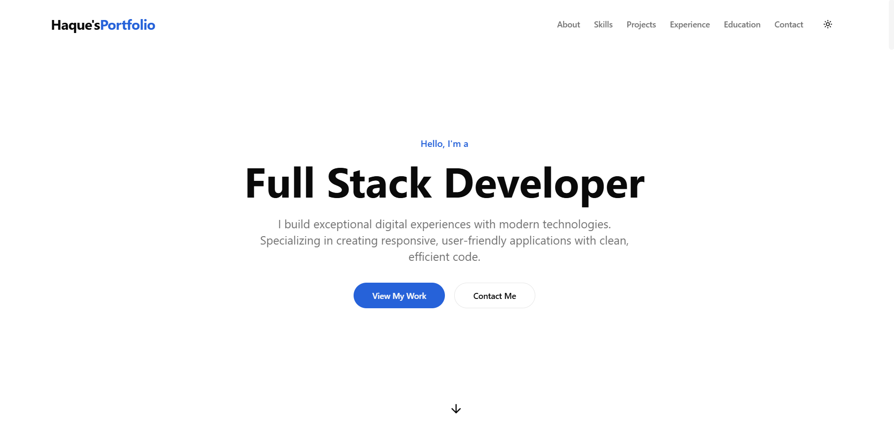

# 🚀 Haque's Portfolio - A Full-Stack Developer Showcase (Frontend)

<div align="center">
  
</div>

<p align="center">
  This repository contains the frontend source code for my personal portfolio, a dynamic and feature-rich application built with Next.js and TypeScript. It showcases my skills, projects, and thoughts through a modern, responsive interface.
</p>

<p align="center">
  <a href="https://portfolio-frontend-nu-six.vercel.app" target="_blank">
    <strong>🌐 View Live Demo</strong>
  </a>
</p>

<p align="center">
  <a href="https://drive.google.com/file/d/1fwL1vwCjXs27QY8oTPCHHUdOKf4IPShe/view?usp=sharing">
    <strong>🎬 Video Explanation Link</strong>
  </a>
</p>

<p align="center">
  
  
  
  
</p>

---

## ✨ Key Features

* **🌐 Dynamic Public Pages**:
    * **Project & Blog Showcase**: Fetches data from a custom Express.js backend with **Incremental Static Regeneration (ISR)** for high performance and fresh content.
    * **On-Demand Revalidation**: Public pages are updated instantly when content is changed in the dashboard, triggered by a secure webhook from the backend.
    * **Static Pages (SSG)**: Core pages like "About Me" are statically generated for maximum speed.

* **🔐 Secure Admin Dashboard**:
    * A private, token-protected dashboard for content management.
    * **Full CRUD Functionality**: Create, Read, Update, and Delete blogs and projects seamlessly.
    * **Rich Text Editor**: Integrated `React Quill` for an enhanced blog writing experience.

* **🎨 Advanced UI/UX**:
    * **Skeleton Loading**: Implemented with `React Suspense` on server components and state-based skeletons on client components for a smooth loading experience.
    * **Smooth Transitions**: Engaging and fluid animations powered by `Framer Motion`.
    * **Instant Feedback**: User actions are confirmed with notifications using `react-hot-toast`.
    * **Responsive Design**: A clean and modern UI that looks great on all devices, from mobile phones to desktops.

---

## 🛠️ Technology Stack

* **Framework**: [Next.js](https://nextjs.org/) (App Router)
* **Language**: [TypeScript](https://www.typescriptlang.org/)
* **Styling**: [Tailwind CSS](https://tailwindcss.com/)
* **UI Components**: [shadcn/ui](https://ui.shadcn.com/)
* **Animations**: [Framer Motion](https://www.framer.com/motion/)
* **State Management**: React Hooks & Context API
* **Notifications**: [React Hot Toast](https://react-hot-toast.com/)
* **Deployment**: [Vercel](https://vercel.com/)

---

## ⚙️ Environment Variables

To run this project locally, create a `.env.local` file in the root directory and add the following variables:
URL of your backend server's API `NEXT_PUBLIC_BACKEND_URL=http://localhost:5000/api` 

A secret token to secure the on-demand revalidation API route.
This must be identical to the token in the backend's `.env` file.
```
REVALIDATION_TOKEN="your_super_secret_token"
NEXT_PUBLIC_BACKEND_URL="your_backend_URL/api"
```

---

## 🚀 Getting Started

1.  **Clone the repository:**
    ```bash
    git clone (https://github.com/maksudulhaque2000/Assignment-7-L2-frontend)
    cd portfolio-frontend
    ```

2.  **Install dependencies:**
    ```bash
    npm install
    ```

3.  **Set up environment variables:**
    * Create a `.env.local` file and add the variables as described above.

4.  **Run the development server:**
    ```bash
    npm run dev
    ```

Open [http://localhost:3000](http://localhost:3000) in your browser to see the result.

---

## 🔑 Admin Credentials for Testing

To access the private dashboard for managing blogs and projects, please use the following credentials on the login page.

| Role  | Email                 | Password      |
| :---- | :-------------------- | :------------ |
| Admin | `admin@example.com`   | `password123` |

**Login Page URL:** `[YOUR_LIVE_DEMO_URL]/login`

---

## 📂 Project Structure

- The frontend is built with Next.js using the App Router, promoting a clean, modular, and scalable architecture.

portfolio-frontend/
├── 📁 app/
│   ├── 📁 (auth)/                 # Route Group for authentication pages
│   │   ├── layout.tsx             # Layout specific to auth pages (e.g., for metadata)
│   │   └── 📁 login/
│   │       └── page.tsx           # Admin login page UI and logic
│   ├── 📁 api/
│   │   └── 📁 revalidate/
│   │       └── route.ts           # Serverless function for On-Demand Revalidation (ISR)
│   ├── 📁 blogs/
│   │   ├── 📁 [id]/
│   │   │   └── page.tsx           # Dynamic page for displaying a single blog post
│   │   └── page.tsx               # Public page for listing all blog posts
│   ├── 📁 dashboard/
│   │   ├── 📁 blogs/               # Pages for CRUD operations on blogs
│   │   ├── 📁 projects/            # Pages for CRUD operations on projects
│   │   ├── layout.tsx             # Secure layout for the entire dashboard
│   │   └── page.tsx               # Dashboard overview/welcome page
│   ├── 📁 projects/
│   │   └── page.tsx               # Public page for listing all projects with search & filter
│   ├── layout.tsx                 # 🌳 Root layout for the entire application
│   └── page.tsx                   # 🏠 Homepage of the portfolio
├── 📁 components/
│   ├── 📁 layout/                # Main layout components (Header, Footer)
│   ├── 📁 sections/              # Components for different sections of the homepage (Hero, About, Resume)
│   └── 📁 ui/                    # Reusable, low-level UI elements (Button, Card, AlertDialog, etc.)
├── 📁 context/
│   └── TabContext.tsx             # React Context to manage shared state (e.g., active resume tab)
├── 📁 data/
│   ├── education.ts               # Static data for the education timeline
│   └── experience.ts              # Static data for the work experience timeline
├── 📁 lib/
│   └── utils.ts                   # Utility functions (e.g., `cn` for Tailwind classnames)
├── 📁 public/
│   └── ...                        # Static assets (images, fonts, resume PDF)
├── types.ts                       #  TypeScript type definitions (Project, Blog, etc.)
└── ...                            # Root configuration files (.env.local, next.config.js, etc.)                     

---

## 🚢 Deployment

This project supports static exports, so it can be easily deployed to any static hosting platform (e.g., Vercel, Netlify, GitHub Pages):

1.  **Build the project:**
    ```bash
    npm run build
    ```
    After the build is complete, static files will be generated in the `out` folder (if `output: 'export'` is set in `next.config.js`). Alternatively, the default Next.js build output (the `.next` folder) will be automatically deployed on platforms like Vercel.

---

## ⚡ Performance

Emphasis has been placed on the following to ensure optimal performance of the portfolio:

* **Optimized Images**: Image optimization using Next.js's `<Image>` component.
* **Lazy Loading**: Components and images are loaded as needed.
* **Efficient Animations**: Hardware-accelerated animations from Framer Motion.
* **Minimal Bundle Size**: Fast loading by excluding unnecessary code.

---

## 📬 Let's Connect

If you like my work or want to discuss a project, feel free to contact me:

* **Email**: [smmaksudulhaque2000@gmail.com](mailto:smmaksudulhaque2000@gmail.com)
* **LinkedIn**: [linkedin.com/in/maksudulhaque2000](https://www.linkedin.com/in/maksudulhaque2000/)
* **GitHub**: [github.com/maksudulhaque2000](https://github.com/maksudulhaque2000)
* **Facebook**: [facebook.com/maksudulhaque2000](https://www.facebook.com/maksudulhaque2000)
* **YouTube**: [youtube.com/@maksudulhaque2000](https://www.youtube.com/@maksudulhaque2000)

---

## 📜 License

This project is licensed under the [MAKSUDUL HAQUE](HAQUE). Feel free to use this project to create your own portfolio!

---